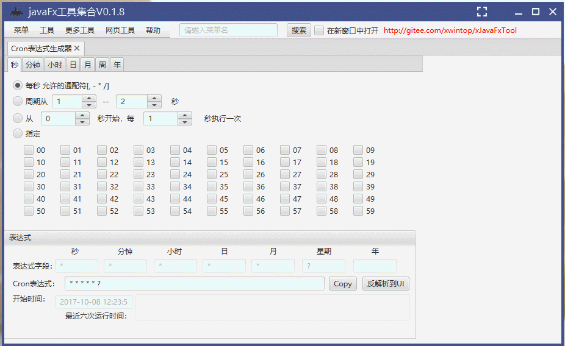
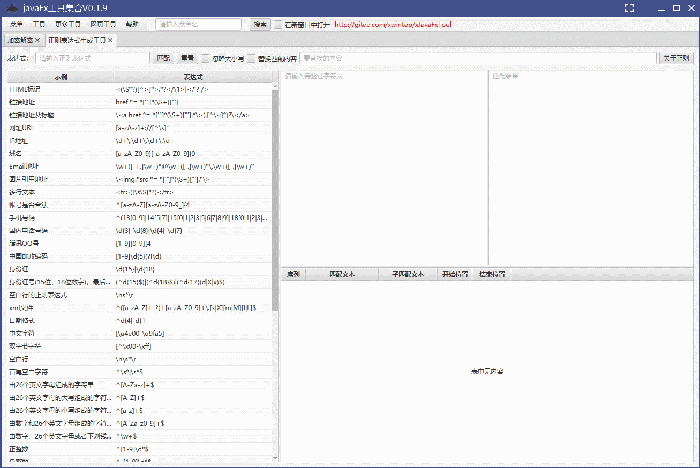

**gitee地址：**[xJavaFxTool](https://gitee.com/xwintop/xJavaFxTool)

**GitHub地址：**[xJavaFxTool](https://github.com/864381832/xJavaFxTool)

**腾讯云开发平台地址：**[xJavaFxTool](https://dev.tencent.com/u/xwintop/p/xJavaFxTool)

[](https://www.apache.org/licenses/LICENSE-2.0.html)
[](https://www.oracle.com/technetwork/java/javase/downloads/index.html) 
[](https://maven.apache.org) 
[](https://gitee.com/xwintop/xJavaFxTool/stargazers) 
[](https://github.com/864381832/xJavaFxTool)
[](https://www.jetbrains.com/?from=xJavaFxTool)


[英文说明/English Documentation](README_EN.md)

**xJavaFxTool交流QQ群: [](https://jq.qq.com/?_wv=1027&k=59UDEAD) 或加群②（已满）[](https://jq.qq.com/?_wv=1027&k=bhAdkju9) 或加群③[](https://jq.qq.com/?_wv=1027&k=zXUFDNuE)**

**xJavaFxTool吐个槽：== [进来吐槽](https://support.qq.com/product/127577) ==**

#### 项目简介：
xJavaFxTool是使用javaFx开发的实用小工具集，利用业余时间把工作中遇到的一些问题总结起来，打包进小工具集中，供大家参考和使用，里面包含了javaFx的一些功能的示例，如布局、国际化、第三方UI库[controlsfx](https://github.com/controlsfx/controlsfx)、[JFoenix](https://github.com/sshahine/JFoenix)等、外部jar包加载(插件机制)等一些常用功能，想学习javaFx的同学可以参考参考，学习javaFx的资料参考[https://openjfx.cn/](https://openjfx.cn/)

由于SpringBoot的火热，项目已经出SpringBoot-javafx版本，[xJavaFxTool-spring](https://gitee.com/xwintop/xJavaFxTool-spring) 欢迎参考，谢谢。

#### 下载地址：
- Linux x64 [xJavaFxTool-1.0.0-linux-x64.deb](https://github.com/864381832/xJavaFxTool/releases/download/1.0.0/xJavaFxTool-1.0.0-linux-x64.deb)
- Linux x64 [xJavaFxTool-1.0.0-linux-x64.rpm](https://github.com/864381832/xJavaFxTool/releases/download/1.0.0/xJavaFxTool-1.0.0-linux-x64.rpm)
- Mac OS aarch64 [xJavaFxTool-1.0.0-macos-aarch64.dmg](https://gitee.com/xwintop/xJavaFxTool/releases/download/v1.0.0/xJavaFxTool-1.0.0-macos-aarch64.dmg)
- Mac OS aarch64 [xJavaFxTool-1.0.0-macos-aarch64.pkg](https://gitee.com/xwintop/xJavaFxTool/releases/download/v1.0.0/xJavaFxTool-1.0.0-macos-aarch64.pkg)
- Mac OS x64 [xJavaFxTool-1.0.0-macos-x64.dmg](https://github.com/864381832/xJavaFxTool/releases/download/1.0.0/xJavaFxTool-1.0.0-macos-x64.dmg)
- Mac OS x64 [xJavaFxTool-1.0.0-macos-x64.pkg](https://github.com/864381832/xJavaFxTool/releases/download/1.0.0/xJavaFxTool-1.0.0-macos-x64.pkg)
- Windows x64 [xJavaFxTool-1.0.0-windows-x64.exe](https://github.com/864381832/xJavaFxTool/releases/download/1.0.0/xJavaFxTool-1.0.0-windows-x64.exe)
- Windows x64 [xJavaFxTool-1.0.0-windows-x64.msi](https://github.com/864381832/xJavaFxTool/releases/download/1.0.0/xJavaFxTool-1.0.0-windows-x64.msi)
- 更多下载地址见123云盘链接：[https://www.123pan.com/s/L5LA-LQ17A.html](https://www.123pan.com/s/L5LA-LQ17A.html) 提取码：java

#### 支持插件开发：
插件开发及示例见[开源项目xJavaFxTool-plugin](https://gitee.com/xwintop/xJavaFxTool-plugin)
目前已将小工具拆分至各模块插件中按需加载，减小jar包的大小，将插件jar包放至根目录libs下即可自动加载;
- [调试相关工具](https://gitee.com/xwintop/xJavaFxTool-debugTools)
- [小工具](https://gitee.com/xwintop/xJavaFxTool-littleTools)
- [相关小游戏](https://gitee.com/xwintop/xJavaFxTool-Games)

#### 环境搭建说明：
- 开发环境为jdk17，基于gradle8.5构建
- 使用eclipase或Intellij Idea开发,推荐使用[Intellij Idea](https://www.jetbrains.com/idea/?from=xJavaFxTool)
- 本项目使用了[lombok](https://projectlombok.org/),在查看本项目时如果您没有下载lombok 插件，请先安装,不然找不到get/set等方法
- 使用jpackager插件进行打包操作,可打包windows(需安装WiX)、Linux(需安装rpm-build)、Mac安装包.
- jdk11启动需添加参数java --add-opens java.base/jdk.internal.loader=ALL-UNNAMED --add-opens jdk.zipfs/jdk.nio.zipfs=ALL-UNNAMED -jar xJavaFxTool.jar  [参考](https://blog.csdn.net/fighting_boss/article/details/91043555)

#### 目前集成的小工具有（点击中文名可进入对应小工具的开源地址）：
| 序号  | 英文名  | 中文名  | 简介                                                                                                                                                                                                                               |
|-----|---|---|----------------------------------------------------------------------------------------------------------------------------------------------------------------------------------------------------------------------------------|
| 1   |FileCopy|[文件复制](https://gitee.com/xwintop/x-FileCopy)| 进行系统文件之间快速复制、移动操作，支持自动调度拷贝功能，使用[quartz](https://www.quartz-scheduler.org/)工具                                                                                                                                                     |
| 2   |CronExpBuilder | [Cron表达式生成器](https://gitee.com/xwintop/x-CronExpBuilder)| cron表达式快速生成及解析测试工具                                                                                                                                                                                                               |
| 3   |CharacterConverter | [编码转换](https://gitee.com/xwintop/x-CharacterConverter)| 常用字符集编码及进制之间转换工具                                                                                                                                                                                                                 |
| 4   |EncryptAndDecrypt | [加密解密](https://gitee.com/xwintop/x-EncryptAndDecrypt)| Ascii、Hex、Base64、Base32、URL、MD5、SHA、AES、DES、文件加密DM5、文件加密SHA1、摩斯密码、Druid加密，使用[commons-codec](http://commons.apache.org/codec/)工具类                                                                                                 |
| 5   |TimeTool | [Time转换](https://gitee.com/xwintop/x-TimeTool)| 常用格式转换(含时区)、计算时间差、时间叠加计算                                                                                                                                                                                                         |
| 6   |LinuxPathToWindowsPath | [路径转换](https://gitee.com/xwintop/x-LinuxPathToWindowsPath)| 进行linux与Windows系统之间路径格式转换，使用[oshi](https://github.com/oshi/oshi)工具                                                                                                                                                               |
| 7   |QRCodeBuilder | [二维码生成工具](https://gitee.com/xwintop/x-QRCodeBuilder)| 自动生成、加入logo、截图识别、自定义格式,使用[google.zxing](https://github.com/zxing/zxing)、[jkeymaster](https://github.com/tulskiy/jkeymaster)等工具                                                                                                   
| 8   |IdCardGenerator | [ID证生成器](https://gitee.com/xwintop/x-IdCardGenerator)| id证序号自动生成器                                                                                                                                                                                                                       |
| 9   |RegexTester | [正则表达式生成工具](https://gitee.com/xwintop/x-RegexTester) | 正则表达式快速生成与测试验证工具                                                                                                                                                                                                                 |
| 10  |ShortURL | [网址缩短工具](https://gitee.com/xwintop/x-ShortURL)| 目前支持百度、新浪、缩我等短网址缩短                                                                                                                                                                                                               |
| 11  |EscapeCharacter | [转义字符](https://gitee.com/xwintop/x-EscapeCharacter)| 支持Html、XML、Java、JavaScript、CSV、Sql之间的转换，使用[commons-lang3](https://commons.apache.org/lang)工具                                                                                                                                     |
| 12  |ZHConverter | [字符串转换](https://gitee.com/xwintop/x-ZHConverter)| 实现拼音、简体-繁体、简体-臺灣正體、简体-香港繁體、繁體-臺灣正體、繁體-香港繁體、香港繁體-臺灣正體、数字金额-大写金额等直接的转换，使用[hanlp](http://hanlp.com/)开源工具                                                                                                                            |
| 13  |ActiveMqTool | [Mq调试工具](https://gitee.com/xwintop/x-ActiveMqTool)| 目前仅支持[ActiveMq](http://activemq.apache.org)                                                                                                                                                                                      
| 14  |HttpTool | [Http调试工具](https://gitee.com/xwintop/x-HttpTool)| 支持自定义发送数据、header和cookie，使用[okhttp](https://square.github.io/okhttp/)                                                                                                                                                             |
| 15  |jsonEditor| json格式化编辑工具| 快速对json文件格式化处理                                                                                                                                                                                                                   |
| 16  |IconTool | [图标生成工具](https://gitee.com/xwintop/x-IconTool)| 快速生成常用大小的图标，支持添加水印、圆角处理，使用[thumbnailator](https://github.com/coobird/thumbnailator)工具                                                                                                                                            |
| 17  |RedisTool | [Redis连接工具](https://gitee.com/xwintop/x-RedisTool)| redis连接工具，完成redis的基本增删改查功能                                                                                                                                                                                                       |
| 18  |WebSourcesTool | [网页源码下载工具](https://gitee.com/xwintop/x-WebSourcesTool)| 可根据网址下载对应网页相关内容及资源                                                                                                                                                                                                               |
| 19  |SwitchHostsTool | [切换Hosts工具](https://gitee.com/xwintop/x-SwitchHostsTool)| 可快速编辑hosts文件内容，使用[richtextfx](https://github.com/FXMisc/RichTextFX)工具                                                                                                                                                            |
| 20  |FtpServer | [Ftp服务器](https://gitee.com/xwintop/x-FtpServer)| 快速搭建本地Ftp服务，基于[apache.ftpserver](https://mina.apache.org/ftpserver-project)                                                                                                                                                      |
| 21  |CmdTool | [Cmd调试工具](https://gitee.com/xwintop/x-CmdTool)| 进行cmd命令操作测试及调度执行                                                                                                                                                                                                                 |
| 22  |FtpClientTool | [Ftp客户端调试工具](https://gitee.com/xwintop/x-FtpClientTool)| 进行ftp(s)/Sftp批量上传、下载、删除文件及文件夹，支持implicit/explicit SSL/TLS协议,使用[jsch](http://www.jcraft.com/jsch) 、[commons-io](http://commons.apache.org/io/) 等工具                                                                                |
| 23  |PdfConvertTool | [Pdf转换工具](https://gitee.com/xwintop/x-PdfConvertTool)| 目前仅支持pdf转图片、pdf转text功能,使用[pdfbox](https://pdfbox.apache.org/)工具                                                                                                                                                                  |
| 24  |DirectoryTreeTool | [文件列表生成器](https://gitee.com/xwintop/x-DirectoryTreeTool)| 快速生成目录结构图片，用于项目展示说明使用                                                                                                                                                                                                            |
| 25  |ImageTool | [图片压缩工具](https://gitee.com/xwintop/x-ImageTool)| 支持对图片进行批量压缩、修改尺寸、转换格式等功能                                                                                                                                                                                                         | 
| 26  |AsciiPicTool | [图片转码工具](https://gitee.com/xwintop/x-AsciiPicTool)| 支持图片生成banner码、图片转Base64码、图片转Excel表                                                                                                                                                                                               | 
| 27  |KafkaTool | [Kafka调试工具](https://gitee.com/xwintop/x-KafkaTool)| (未完善)，使用了[kafka-clients](http://kafka.apache.org/)                                                                                                                                                                               | 
| 28  |EmailTool | [邮件发送工具](https://gitee.com/xwintop/x-EmailTool)| 支持各种协议的邮件发送及自定义群发模版，使用[commons-email](https://commons.apache.org/email)工具                                                                                                                                                        |
| 29  |ColorCodeConverterTool | [颜色代码转换工具](https://gitee.com/xwintop/x-ColorCodeConverterTool)| 对颜色包括16进制、RGB、ARGB、RGBA、HSL、HSV等代码之间转换                                                                                                                                                                                           | 
| 30  |SmsTool | [短信群发工具](https://gitee.com/xwintop/x-SmsTool)| 进行短信批量发送，目前支持中国移动、中国电信、腾讯云、阿里云、梦网云通讯等平台                                                                                                                                                                                          |
| 31  |ScriptEngineTool | [脚本引擎调试工具](https://gitee.com/xwintop/x-ScriptEngineTool)| 执行各种脚本命令，目前支持JavaScript、Groovy、Python、Lua等脚本，使用[groovy](http://groovy-lang.org)、[jython](https://jython.org)、[luaj](http://www.luaj.org/luaj.html) 等工具                                                                           |
| 32  |FileRenameTool | [文件重命名工具](https://gitee.com/xwintop/x-FileRenameTool)| 对文件进行自定义快捷重命名操作                                                                                                                                                                                                                  |
| 33  |JsonConvertTool | [Json转换工具](https://gitee.com/xwintop/x-JsonConvertTool)| 目前支持Json转Xml、Json转Java实体类、Json转C#实体类、Json转Excel、Json转Yaml、Properties转Yaml、Yaml转Properties，使用[fastjson](https://github.com/alibaba/fastjson)、[snakeyaml](https://bitbucket.org/asomov/snakeyaml)、[dom4j](https://dom4j.github.io) | 等工具|
| 34  |WechatJumpGameTool | [微信跳一跳助手](https://gitee.com/xwintop/x-WechatJumpGameTool)| 对微信跳一跳游戏的辅助                                                                                                                                                                                                                      |
| 35  |TextToSpeechTool | [语音转换工具](https://gitee.com/xwintop/x-TextToSpeechTool)| 调用[百度语音](https://ai.baidu.com/tech/speech/tts)转换api将字符串转换为语音格式并朗读                                                                                                                                                                |
| 36  |2048|小游戏2048| 小游戏2048javafx版本                                                                                                                                                                                                                  |
| 37  |SocketTool | [Socket调试工具](https://gitee.com/xwintop/x-SocketTool)| 使用[Apache Mina](http://mina.apache.org)                                                                                                                                                                                          | 实现Tcp、Udp服务端和Client端|
| 38  |ImageAnalysisTool | [图片解析工具](https://gitee.com/xwintop/x-ImageAnalysisTool)| 1、.atlas文件反解析2、图片快速拆分工具                                                                                                                                                                                                          |
| 39  |DecompilerWxApkgTool | [微信小程序反编译工具](https://gitee.com/xwintop/x-DecompilerWxApkgTool)| 一键反编译微信小程序包                                                                                                                                                                                                                      |
| 40  |ZookeeperTool | [Zookeeper工具](https://gitee.com/xwintop/x-ZookeeperTool)| 方便对zookeeper的一系列操作，包括新增、修改、删除(包括子文件) 、重命名、复制、添加变更通知                                                                                                                                                                              |
| 41  |ExcelSplitTool | [Excel拆分工具](https://gitee.com/xwintop/x-ExcelSplitTool)| 支持对xls、xlsx、csv及文件进行拆分操作，使用[commons-csv](http://commons.apache.org/csv)工具                                                                                                                                                        |
| 42  |PathWatchTool | [文件夹监控工具](https://gitee.com/xwintop/x-PathWatchTool)| 支持对文件夹进行监控操作，包括新增、修改、删除操作的监听                                                                                                                                                                                                     |
| 43  |CharsetDetectTool | [文件编码检测工具](https://gitee.com/xwintop/x-CharsetDetectTool)| 对文件编码进行检测识别，使用[juniversalchardet](https://github.com/albfernandez/juniversalchardet)工具                                                                                                                                           |
| 44  |TransferTool | [传输工具](https://gitee.com/xwintop/x-TransferTool)| 集成各种传输协议，使用自定义定时任务(简单模式、cron表达式模式)，分为Receiver接收器、Filter处理器、Sender发送器                                                                                                                                                             |
| 45  |ScanPortTool | [端口扫描工具](https://gitee.com/xwintop/x-ScanPortTool)| 快速测试常用端口及自定义端口的联通性                                                                                                                                                                                                               |
| 46  |FileMergeTool | [文件合并工具](https://gitee.com/xwintop/x-FileMergeTool)| 支持对xls、xlsx、csv及文件进行合并操作，使用[apache.poi](http://poi.apache.org/)工具                                                                                                                                                                |
| 47  |SedentaryReminderTool | [久坐提醒工具](https://gitee.com/xwintop/x-SedentaryReminderTool)| 自定义时长倒计时提醒功能                                                                                                                                                                                                                     |
| 48  |RandomGeneratorTool | [随机数生成工具](https://gitee.com/xwintop/x-RandomGeneratorTool)| 快速生成各种类型的随机数,使用[hutool](https://hutool.cn)工具                                                                                                                                                                                     |
| 49  |ClipboardHistoryTool | [剪贴板历史工具](https://gitee.com/xwintop/x-ClipboardHistoryTool)| 记录剪贴板历史功能                                                                                                                                                                                                                        |
| 50  |FileSearchTool | [文件搜索工具](https://gitee.com/xwintop/x-FileSearchTool)| 快速建立磁盘文件索引，达到快速搜索的功能，使用[lucene](https://lucene.apache.org/)搜索引擎                                                                                                                                                                  |
| 51  |Mp3ConvertTool | [Mp3转换工具](https://gitee.com/xwintop/x-Mp3ConvertTool)| 目前支持网易云音乐.ncm、QQ音乐.qmc转换为mp3格式，使用[jaudiotagger](http://www.jthink.net/jaudiotagger)工具                                                                                                                                            |
| 52  |SealBuilderTool | [印章生成工具](https://gitee.com/xwintop/x-SealBuilderTool)| 快速生成多种风格、多种字体的个性化印章                                                                                                                                                                                                              |
| 53  |BullsAndCowsGame| 猜数字游戏| 古老的的密码破译类益智类小游戏                                                                                                                                                                                                                  |
| 54  |FileUnicodeTransformationTool | [文件编码转换工具](https://gitee.com/xwintop/x-FileUnicodeTransformationTool)| 快速实现文件编码批量转换                                                                                                                                                                                                                     |
| 55  |FileCompressTool | [文件解压缩工具](https://gitee.com/xwintop/x-FileCompressTool)| 对文件进行解压缩处理，目前支持ar、zip、tar、jar、cpio、7z、gz、rar、bzip2、xz、lzma、pack200、deflate、snappy-framed、lz4-block、lz4-framed、zstd等格式解压缩                                                                                                         |
| 56  |IdiomDataTool | [成语字典工具](https://gitee.com/xwintop/x-IdiomDataTool)| 可多种模式快速对成语进行索引,使用[h2](http://www.h2database.com)数据库存储数据字典                                                                                                                                                                        |
| 57  |Sudoku|数独游戏| 益智类数独游戏javafx版本                                                                                                                                                                                                                  |
| 58  |LiteappCode|小程序码生成工具| 快速生成小程序码                                                                                                                                                                                                                         |
| 59  |RdbmsSyncTool | [关系型数据库同步工具](https://gitee.com/xwintop/x-RdbmsSyncTool)| 完成关系型数据库表结构获取，快捷执行一些常用数据库脚本，支持多种类型数据库直接数据转移，同步                                                                                                                                                                                   |
| 60  |FileBuildTool | [文件生成工具](https://gitee.com/xwintop/x-FileBuildTool)| 根据自定义模板快速批量生成文件，用于测试使用                                                                                                                                                                                                           |
| 61  |LuytenTool | [Java反编译工具](https://gitee.com/xwintop/x-LuytenTool)| 对jar包进行反编译操作，使用开源项目[luyten](https://github.com/deathmarine/Luyten)                                                                                                                                                               |
| 62  |JavaService | [Java服务安装工具](https://gitee.com/xwintop/x-JavaService)| 将java程序安装到windows服务中，引用服务，使用开源项目[winsw](https://github.com/winsw/winsw)                                                                                                                                                          |
| 63  |ElementaryArithmeticProblemTool | [小学生算数题生成工具](https://gitee.com/xwintop/x-ElementaryArithmeticProblemTool)| 小学生混合运算加减乘除数学训练题出题答案生成工具                                                                                                                                                                                                         |
| 64  |CoordinateTransformTool | [坐标系转换工具](https://gitee.com/xwintop/x-CoordinateTransformTool)| 提供了百度坐标（BD09）、国测局坐标（火星坐标，GCJ02）、和WGS84坐标系之间的转换                                                                                                                                                                                   |
| 65  |HdfsTool | [hdfs管理工具](https://gitee.com/xwintop/x-HdfsTool)| hdfs可视化管理工具，支持上传、下载、重命名、复制、移动和删除等功能                                                                                                                                                                                              |
| 66  |JavaFxXmlToObjectCode| [javaFxFxml转换代码](https://gitee.com/xwintop/x-JavaFxXmlToObjectCode)| 根据.fxml文件生成相应的java代码，可生成插件模版                                                                                                                                                                                                     |
| 67  |KeyTool| [KeyTool](https://gitee.com/xwintop/x-KeyTool)| license生成工具                                                                                                                                                                                                                      |
| 68  |RelationshipCalculator|[亲戚关系计算器](https://gitee.com/xwintop/x-RelationshipCalculator)| 通过亲戚关系链计算称呼的功能                                                                                                                                                                                                                   |
| 69  |ExpressionParserTool|[表达式解析器调试工具](https://gitee.com/xwintop/x-ExpressionParserTool)| 一款表达式解析器调试工具，目前支持SpringEL、Velocity 、FreeMarker、StringTemplate、Mvel、Aviator、commons-jexl 、BeanShell、QLExpress等表达式引擎                                                                                                               |
| 70  |mybatis-generator-gui|[Mybatis代码生成工具](https://gitee.com/zhuifeng335/mybatis-generator-gui)| 本工具可以使你非常容易及快速生成Mybatis的Java POJO文件及数据库Mapping文件                                                                                                                                                                                 |

项目开发中，以后会陆续添加新工具，欢迎大家参与其中，多提提意见，谢谢。

#### 项目结构

```
xJavaFxTool
├─ images	项目截图
├─ pom.xml	maven配置文件
├─ README.md	说明文件
├─ src
│ ├─ main
│ │ ├─ java
│ │ │ └─ com
│ │ │  └─ xwintop
│ │ │   └─ xJavaFxTool
│ │ │    ├─ common	第三方工具类
│ │ │    ├─ controller	javafx控制层
│ │ │    │ └─ index	首页控制层
│ │ │    ├─ model	基础bean类层
│ │ │    ├─ services	工具服务层
│ │ │    │ └─ index	首页工具服务层
│ │ │    ├─ utils	系统工具类
│ │ │    └─ view	javafx视图层
│ │ │       └─ index	首页工具视图层
│ │ └─ resources
│ │  ├─ com
│ │  │ └─ xwintop
│ │  │  └─ xJavaFxTool
│ │  │   └─ fxmlView     .fxml文件
│ │  ├─ config	配置文件
│ │  │ └─ toolFxmlLoaderConfiguration.xml	系统菜单加载配置文件
│ │  ├─ css	样式资源
│ │  ├─ images	图片资源
│ │  ├─ locale	国际化
│ │  ├─ banner.txt	启动banner图片
│ │  └─ logback.xml	logback日志配置文件
│ └─ test  测试类
│  ├─ java
│  └─ resources

```

##### 📈 趋势
[](https://giteye.net/chart/2ZF6FD8R)
##### 🍚 贡献
[](https://giteye.net/chart/K3ZV48G2)

#### 特别感谢
在一个人还年轻的时候，我觉得，就应该着手致力做一些对社会有意义的事情，一如开源。至此，感谢以下贡献者(排名不分先后)：
+ [李柱](https://gitee.com/loyalty521)
+ [luming](https://gitee.com/jeeweb)
+ [码志](https://gitee.com/dazer1992)
+ [三叔](https://gitee.com/bejson)

#### 后续计划
不定期添加汇总开发过程中需求的痛点工具，大家有工作上的痛点处可进群讨论，后期可能就会出相应的工具解决方案，谢谢大家的支持。

#### 项目截图如下：





