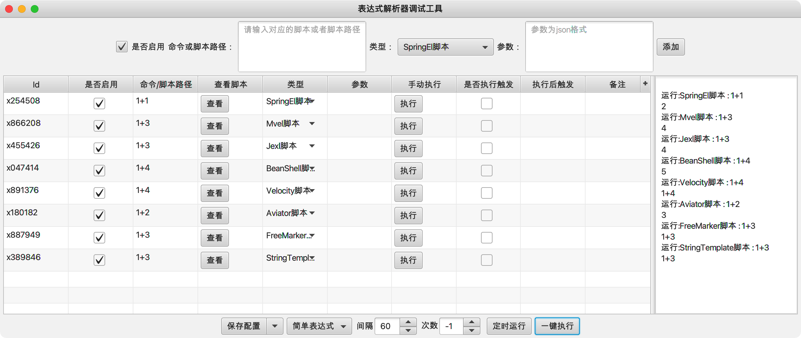

ExpressionParserTool  表达式解析器调试工具

#### 项目简介：
ExpressionParserTool是使用javafx开发的一款表达式解析器调试工具，目前支持[SpringEL](https://docs.spring.io/spring-framework/docs/current/reference/html/core.html) 、[Velocity](http://velocity.apache.org/) 、[FreeMarker](http://freemarker.foofun.cn) 、[StringTemplate](https://www.stringtemplate.org) 、[Mvel](http://mvel.documentnode.com) 、[Aviator](http://fnil.net/aviator) 、[commons-jexl](http://commons.apache.org/proper/commons-jexl/index.html) 、[BeanShell](https://github.com/beanshell/beanshell) 、[QLExpress](https://github.com/alibaba/QLExpress) 等表达式引擎，支持在线调试运行脚本，及定时调度执行脚本。

#### 目前支持以下表达式引擎：
- [SpringEL](https://docs.spring.io/spring-framework/docs/current/reference/html/core.html) 是一个支持查询和操作运行时对象导航图功能的强大的表达式语言，不直接依赖于Spring,可独立使用
- [Velocity](http://velocity.apache.org) 一个基于java的模板引擎（template engine）。它允许任何人仅仅简单的使用模板语言（template language）来引用由java代码定义的对象
- [FreeMarker](http://freemarker.foofun.cn) 一种基于模板和要改变的数据， 并用来生成输出文本(HTML网页，电子邮件，配置文件，源代码等)的通用工具
- [StringTemplate](https://www.stringtemplate.org) 一种基于java的模板引擎库，可以用于生成源代码、web页面、电子邮件等多种样式的文本
- [Mvel](http://mvel.documentnode.com) 是一个功能强大的基于Java应用程序的表达式语言
- [Aviator](http://fnil.net/aviator) 是一个高性能、轻量级的java语言实现的表达式求值引擎,主要用于各种表达式的动态求值
- [commons-jexl](http://commons.apache.org/proper/commons-jexl/index.html) 是一个表达式语言引擎，可以用来在应用或者框架中使用
- [BeanShell](https://github.com/beanshell/beanshell) 是一个小型的、免费的、可嵌入的 Java 源代码解释器，具有对象脚本语言特性，用 Java 编写
- [QLExpress](https://github.com/alibaba/QLExpress) 由阿里的电商业务规则、表达式（布尔组合）、特殊数学公式计算（高精度）、语法分析、脚本二次定制等强需求而设计的一门动态脚本引擎解析工具

**xJavaFxTool交流QQ群：== [387473650(此群已满)](https://jq.qq.com/?_wv=1027&k=59UDEAD) 请加群②[1104780992](https://jq.qq.com/?_wv=1027&k=bhAdkju9) ==**

#### 环境搭建说明：
- 开发环境为jdk1.8，基于maven构建
- 使用eclipase或Intellij Idea开发(推荐使用[Intellij Idea](https://www.jetbrains.com/?from=xJavaFxTool) )
- 该项目为javaFx开发的实用小工具集[xJavaFxTool](https://gitee.com/xwintop/xJavaFxTool) 的插件，可在xJavaFxTool工具中下载使用。
- 本项目使用了[lombok](https://projectlombok.org/) ,在查看本项目时如果您没有下载lombok 插件，请先安装,不然找不到get/set等方法
- 依赖的[xcore包](https://gitee.com/xwintop/xcore) 已上传至git托管的maven平台，git托管maven可参考教程(若无法下载请拉取项目自行编译)。[教程地址：点击进入](http://blog.csdn.net/u011747754/article/details/78574026) 

