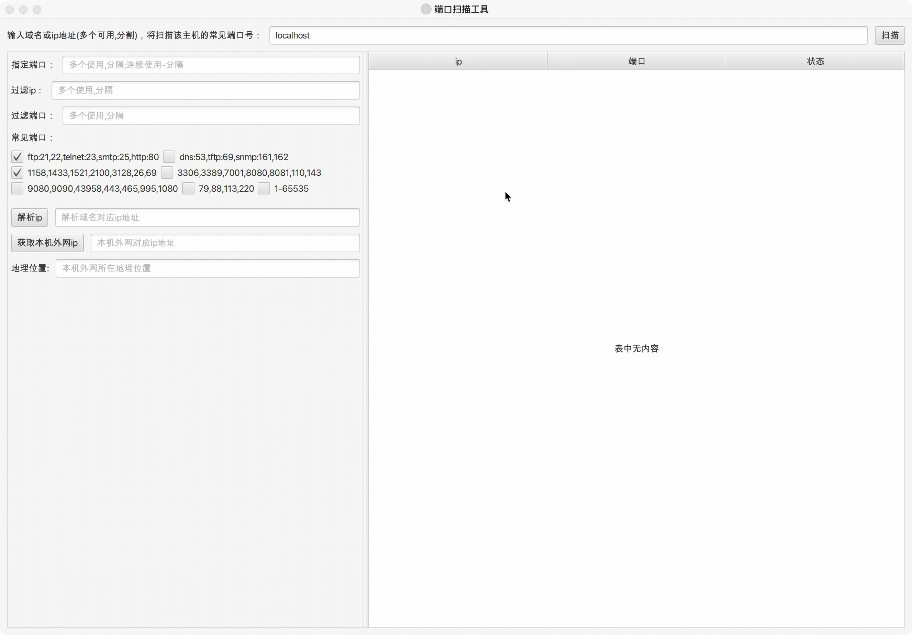

ScanPortTool  端口扫描工具

#### 项目简介：
ScanPortTool是使用javafx开发的一款端口扫描工具，支持多ip、多端口批量检查，常用端口查询，解析域名对应ip地址，获取本机外网ip功能。

**xJavaFxTool交流QQ群：== [387473650(此群已满)](https://jq.qq.com/?_wv=1027&k=59UDEAD) 请加群②[1104780992](https://jq.qq.com/?_wv=1027&k=bhAdkju9) ==**

#### 环境搭建说明：
- 开发环境为jdk1.8，基于maven构建
- 使用eclipase或Intellij Idea开发(推荐使用[Intellij Idea](https://www.jetbrains.com/?from=xJavaFxTool))
- 该项目为javaFx开发的实用小工具集[xJavaFxTool](https://gitee.com/xwintop/xJavaFxTool)的插件。
- 本项目使用了[lombok](https://projectlombok.org/),在查看本项目时如果您没有下载lombok 插件，请先安装,不然找不到get/set等方法
- 依赖的[xcore包](https://gitee.com/xwintop/xcore)已上传至git托管的maven平台，git托管maven可参考教程(若无法下载请拉取项目自行编译)。[教程地址：点击进入](http://blog.csdn.net/u011747754/article/details/78574026)

#### 版本记录
- 0.0.1
  1. 完成基本功能配置
- 0.0.2
  1. 优化扫描代码
- 0.0.3 2020-12-30
  1. 添加多ip支持，添加ip、端口过滤功能
- 0.0.4 2021-09-10
  1. 添加端口连续扫描支持
  2. 添加解析域名对应ip地址功能
  3. 添加获取本机外网ip功能