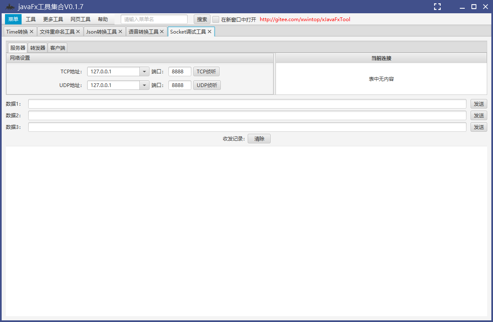
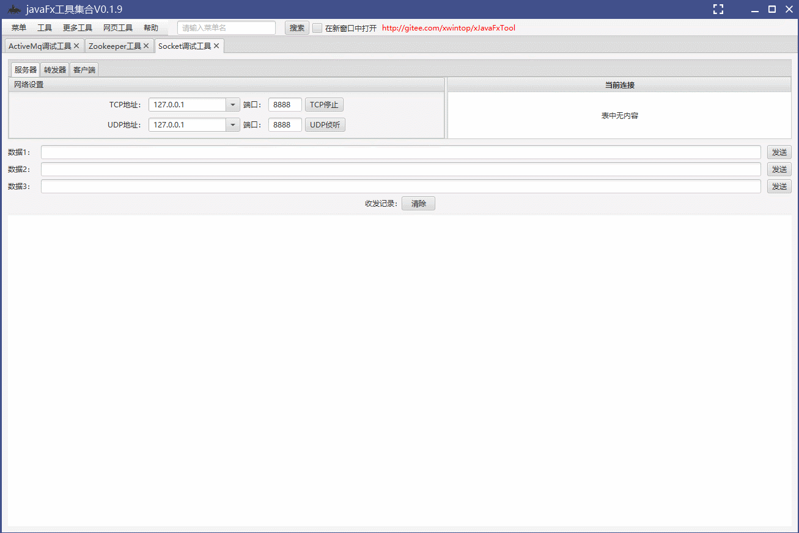

SocketTool  Socket调试工具

#### 项目简介：
SocketTool是使用javafx开发的一款Socket调试工具，使用[Apache Mina](http://mina.apache.org)工具包实现Tcp、Udp服务端和Client端，用来接收,发送,转发TCP或UDP数据包，可以用来测试的任何使用 TCP 或 UDP 协议进行通信的服务器或客户端，帮助网络编程人员、网络维护人员检查所开发的网络应用软硬件的通信状况。

#### 功能特色
1. 全面集成 TCP服务器/客户端、UDP服务器/客户端功能
2. 添加对ssl传输支持
3. 在一个程序内可进行多类型的Socket的创建/删除/以及数据收发等操作
4. 支持服务端自动回复功能，可自定义回复内容
5. 用户可以方便的把接收到的数据保存下来

**xJavaFxTool交流QQ群：== [387473650](https://jq.qq.com/?_wv=1027&k=59UDEAD) ==**

#### 环境搭建说明：
- 开发环境为jdk1.8，基于maven构建
- 使用eclipase或Intellij Idea开发(推荐使用[Intellij Idea](https://www.jetbrains.com/?from=xJavaFxTool))
- 该项目为javaFx开发的实用小工具集[xJavaFxTool](https://gitee.com/xwintop/xJavaFxTool)的插件。
- 本项目使用了[lombok](https://projectlombok.org/),在查看本项目时如果您没有下载lombok 插件，请先安装,不然找不到get/set等方法
- 依赖的[xcore包](https://gitee.com/xwintop/xcore)已上传至git托管的maven平台，git托管maven可参考教程(若无法下载请拉取项目自行编译)。[教程地址：点击进入](http://blog.csdn.net/u011747754/article/details/78574026)

- V0.0.2
- 20200802
  添加服务端自动回复功能
- 20200803
  添加ssl传输支持
- 2022-04-05 V0.0.3
添加系统图标
