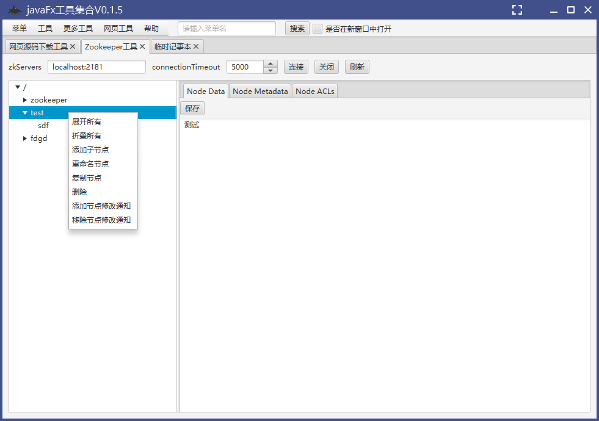

ZookeeperTool Zookeeper管理工具

#### 项目简介：
ZookeeperTool是使用javafx开发的Zookeeper管理工具，方便对zookeeper的一系列操作，包括新增、修改、删除(包括子文件)、重命名、复制、添加变更通知。

(引用了[zkclient](https://github.com/sgroschupf/zkclient)工具包)

**xJavaFxTool交流QQ群：== [387473650](https://jq.qq.com/?_wv=1027&k=59UDEAD) ==**

#### 环境搭建说明：
- 开发环境为jdk1.8，基于maven构建
- 使用eclipase或Intellij Idea开发(推荐使用[Intellij Idea](https://www.jetbrains.com/?from=xJavaFxTool))
- 该项目为javaFx开发的实用小工具集[xJavaFxTool](https://gitee.com/xwintop/xJavaFxTool)的插件。
- 本项目使用了[lombok](https://projectlombok.org/),在查看本项目时如果您没有下载lombok 插件，请先安装,不然找不到get/set等方法
- 依赖的[xcore包](https://gitee.com/xwintop/xcore)已上传至git托管的maven平台，git托管maven可参考教程(若无法下载请拉取项目自行编译)。[教程地址：点击进入](http://blog.csdn.net/u011747754/article/details/78574026)

2020-11-13 v0.0.2
1. 优化zookeeper工具加载模式
2. 添加zookeeper工具中数据框历史记录功能

2020-11-13 v0.0.3
1. 修改图标