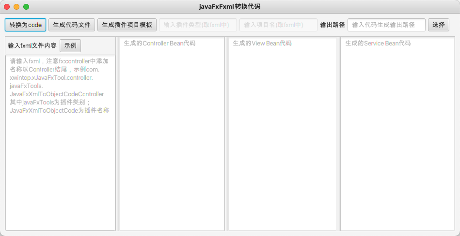

JavaFxXmlToObjectCode javaFxFxml转换代码

#### 项目简介：
JavaFxXmlToObjectCode是使用javafx开发的一款javaFxFxml转换代码，根据.fxml文件生成相应的java代码，可生成插件模版。

**xJavaFxTool交流QQ群：== [387473650(此群已满)](https://jq.qq.com/?_wv=1027&k=59UDEAD) 请加群②[1104780992](https://jq.qq.com/?_wv=1027&k=bhAdkju9) ==**

#### 环境搭建说明：
- 开发环境为jdk1.8，基于maven构建
- 使用eclipase或Intellij Idea开发(推荐使用[Intellij Idea](https://www.jetbrains.com/?from=xJavaFxTool))
- 该项目为javaFx开发的实用小工具集[xJavaFxTool](https://gitee.com/xwintop/xJavaFxTool)的插件。
- 本项目使用了[lombok](https://projectlombok.org/),在查看本项目时如果您没有下载lombok 插件，请先安装,不然找不到get/set等方法
- 依赖的[xcore包](https://gitee.com/xwintop/xcore)已上传至git托管的maven平台，git托管maven可参考教程(若无法下载请拉取项目自行编译)。[教程地址：点击进入](http://blog.csdn.net/u011747754/article/details/78574026)

#### 版本记录
- 0.0.1
  1. 完成基本功能配置(根据.fxml文件生成相应的java代码)
- 0.0.2  2020-04-19
  1. 添加生成插件模版功能
